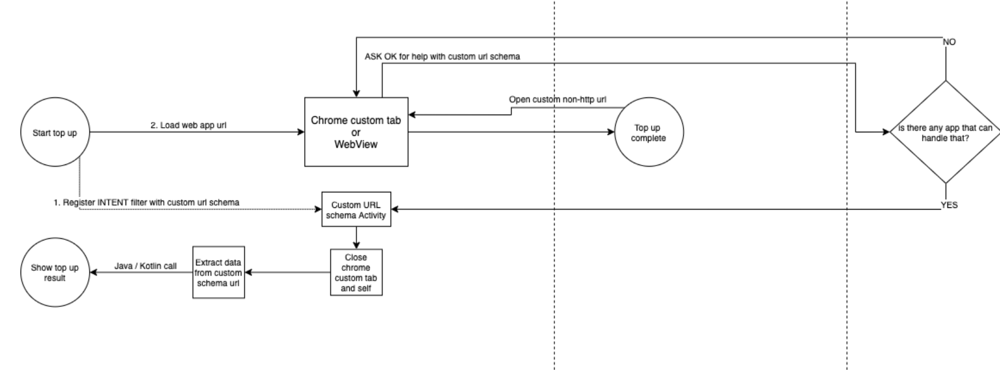

# ryd pay Web SDK integration sample
This sample illustrates how to integrate the ryd pay Web SDK into a native Android 
application by using Chrome Custom tabs. There are several additional ways of handling the same
functionality such as implementing a dedicated WebView or even launching an external browser. In all
case the results of the ryd pay web sdk will be delivered back to the app through a custom url schema
described in the dedicated section below.

### General overview of this sample

This sample application has a dedicated Activity (`CCTHandlerActivity`) that initializes and starts a
Chrome Custom Tab session with an input url of the ryd pay web sdk. In addition, it has registered 
in the Android Manifest a custom url schema so that it will be reopened once the top up flow in the
web is complete. Whenever this happens it tries to parse the data from the callback url and deliver it
through the standard Android ActivityResult API to the caller Activity that started it.

### Implementation details

##### Launching the ryd pay web
To be defined

##### Consuming results of the ryd pay web
To be defined